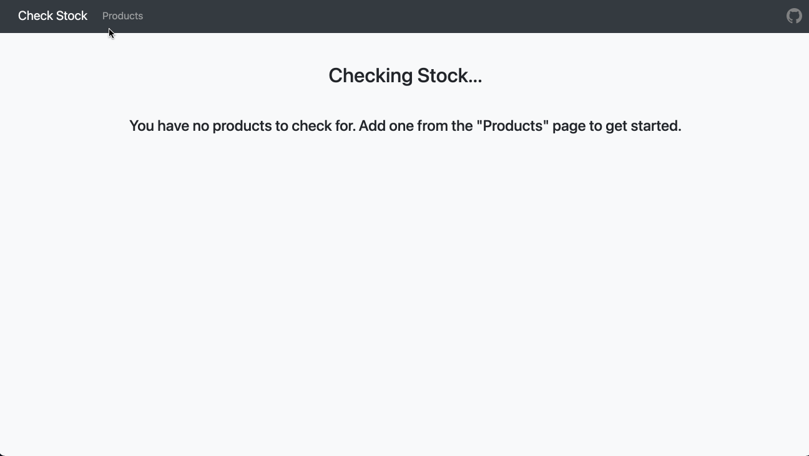

# check-stock-app

## Automatically check the stock status of products

### Supported websites:

-   <a href="https://www.chapters.indigo.ca/en-ca/">chapters.indigo.ca</a>
-   <a href="https://www.lego.com/en-ca/">lego.com</a>
-   <a href="https://www.boardgamebliss.com/">boardgamebliss.com</a>

More websites forthcoming!

## To-do

1. Rephrase stock messages
2. Create filter to only view products from certain stores
3. Add option to change "nickname" of product
4. Make product list sortable
5. Add option to select which columns to display
6. Stores to add:
    - Amazon.ca
    - Rona.ca
    - RenoDepot.ca
7. Option to subscribe to notifications when stock/price changes
